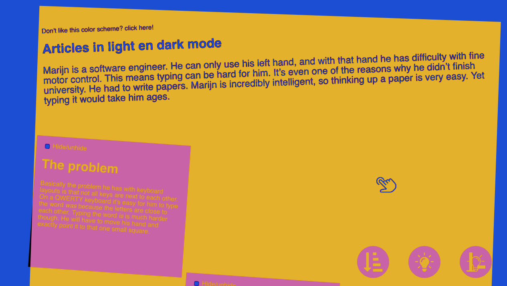

# Article with dark and light mode

### Disclaimer

This site uses some very experimental css and therefore currently only works on Firefox nightly, and works best when downloaded onto your machine.

You can also test it on my laptop if you don't feel like downloading the repo and/or nightly.

Get nightly here:
https://www.mozilla.org/nl/firefox/channel/desktop/#nightly

## Idea:

An article with an extrovert layout, but with possibilites to tone it all down if you dislike the looks and/or readability.

## Assignment:

Article with dark/light mode.

## Restrictions:

- CSS file smaller than 5kb (as of now it is ~3kb)
- Using a maximum of two colors
- Site responds to language settings (Very minimally, but the font-size is bigger when the user uses a language other than English, for easier reading)

## Color usage:

Black + white + one random color.

## Sources icons:

Position icon made by <a href="https://www.flaticon.com/authors/dave-gandy" title="Dave Gandy">Dave Gandy</a> from <a href="https://www.flaticon.com/" 			    title="Flaticon">www.flaticon.com</a> is licensed by <a href="http://creativecommons.org/licenses/by/3.0/" 			    title="Creative Commons BY 3.0" target="_blank">CC 3.0 BY</a>

Lightbulb icon made by <a href="https://www.flaticon.com/authors/good-ware" title="Good Ware">Good Ware</a> from <a href="https://www.flaticon.com/" 			    title="Flaticon">www.flaticon.com</a> is licensed by <a href="http://creativecommons.org/licenses/by/3.0/" 			    title="Creative Commons BY 3.0" target="_blank">CC 3.0 BY</a>

